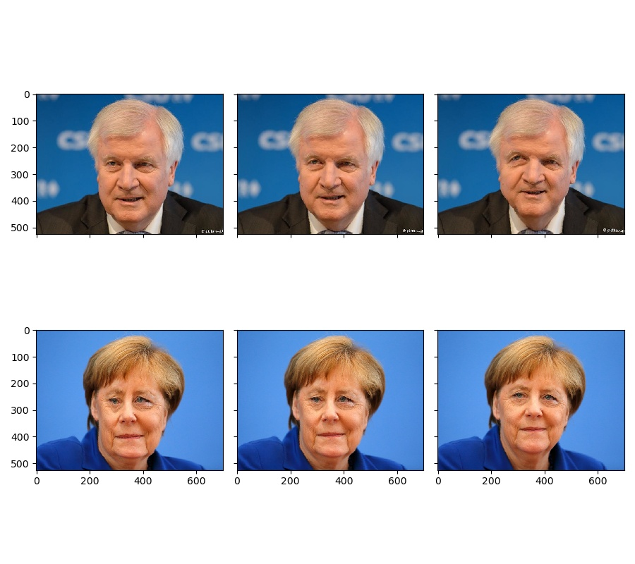

# Gesichter Morphing in Python

Die Umsetzung der oben genannten Arbeitsschritte des Morphing-Prozesses wird mit einem Programm, das in der Programmiersprache Python geschrieben wird, realisiert.

Folgenden Module wurden verwendet:

-   numpy
-   scipy
-   matplotlib
-   PIL
-   pyqt5

Das Programm kann entweder über eine GUI gestart werden `main.py` oder um detailierte plots zu erhalten über `morph.py` Neue Punkte können nur über die GUI festgelegt werden.

# Starten des Programms

Wenn die oben genannten Module bereits installiert sind kann die GUI mit dem folgendem Befehl gestartet werden.

```shell
python main.py
```

und um die verschiedene Plots zu generieren:

```shell
python morph.py
```

Dabei enstehen die folgenden Plots

 In der zweiten reiehe werden zusätzlich die gewählten Start- und Endpunkte sowie die Triangulierung angezeigt.




<animation.webp>


## Verwendung der GUI

Im User Interface kann der Benutzer das Quellbild und das Zielbild mit dem Button „Load Image“ auswählen. Beim Einfügen eines Bildes werden zudem markante Punkten mit eingefügt, die der Bediener noch nachjustieren kann. So erscheinen beim Hinzufügen des Bildes gleichzeitig vier Punkte, die durch Anklicken des Punktes verschoben werden können. Diese Punkte sind in verschiedenen Farben coloriert und sollen so positioniert werden, dass die jeweils gleichen Farben den gleichen Teil des Objektes in beiden Bildern markieren. Bei Gesichtern können beispielsweise die roten Punkte auf das linke Ohr, die blauen Punkte auf das rechte Ohr, die grünen Punkte auf die Stirnmitte und die gelben Punkte auf dem Kinn positioniert werden.

## Berechnung der Transformation

```python
 1  def warp_sequence(self,o_warper,steps,dtype=np.uint8):
 2      """
 3      Start der Morphing sequence
 4  
 5      Für jeden zwischenschritt für die Animation:
 6  
 7      1. Verschiebung der einzelenen punkte berechnen
 8      2. Punktmenge triagunlieren (delaunay)
 9      3. Verzerrungs matrix berechnen
10      4. Für beide Bilder aus Ursprungsbild neues Bild erzeugen
11  
12      """
13      with open("testwarp.npz","w+b") as file:
14          np.savez(file,self.points,o_warper.points)
15  
16      points = self.warp_steps(steps,o_warper.allPoints(o_warper.getBoxes()),self.allPoints(self.getBoxes()))
17      step1 = self.warp_points(steps,points,np.copy(self.pic),np.copy(o_warper.pic),list())
18  
19      return step1
```

<morph.py>

Zuerst werden die Zwischenschritte der Punkte berechnet.

```python
 1  def warp_steps(self,steps,spoints,dpoints):
 2      res = []
 3      points_step = []
 4      for point in zip(spoints,dpoints):
 5          line = [point[0]]
 6          x = (point[1][0] - point[0][0])/steps
 7          y = (point[1][1] - point[0][1])/steps
 8          for i in range(1,steps):
 9              line.append([point[0][0] + (i * x),point[0][1] + (i * y)])
10          line.append(point[1])
11          res.append(line)
12      return np.array(res)
```

<morph.py>

Dann wird für beide Bilder für alle Dreiecke eine Verschiebungsmatrix erzeugt. Dafür werden zuvor die Dreiecke benötigt.

```python
1  dpoints = points[:,i,:2]
2  delaunay = spatial.Delaunay(dpoints)
3  #Wird später zum erstellen der Plots benötigt
4  self.delauny.append([delaunay,np.copy(dpoints)])
5  
6  triangles = np.asarray(list(self.triangle_matrix(
7      delaunay.simplices, spoints , dpoints)))
```

<morph.py>

```python
1  def triangle_matrix(self,vert,s_points,d_points):
2          ones = [1, 1, 1]
3          for tri_indices in vert:
4                  src_tri = np.vstack((s_points[tri_indices, :].T, ones))
5                  dst_tri = np.vstack((d_points[tri_indices, :].T, ones))
6                  mat = np.dot(src_tri, np.linalg.inv(dst_tri))[:2, :]
7                  yield mat
```

<morph.py>

Mithilfe der Matrix können dann mittels Bilinearer Interpolation die Pixel im Bild neu zugeordnet werden.

## Überblendung

Die Überblendung erfolgt bei der Ausgabe der Bilder. Dabei wird aus eine Animation erzeugt.

## Links

-   <https://numpy.org/>
-   <https://www.scipy.org/>
-   <https://matplotlib.org/>
-   <https://python-pillow.org/>
